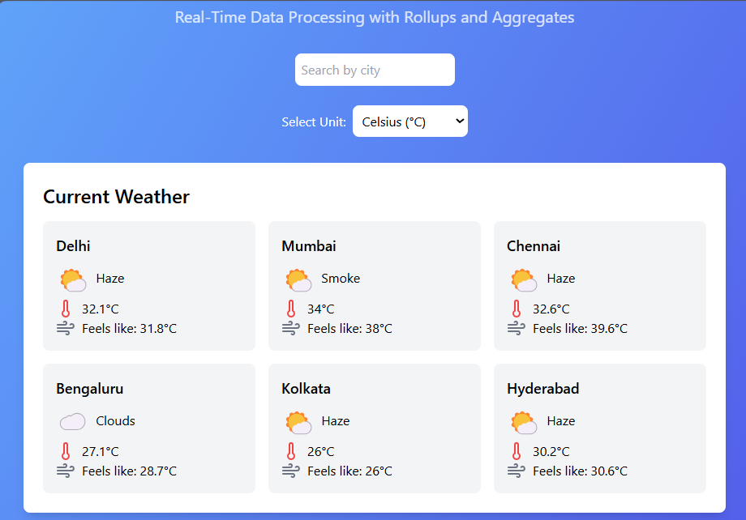
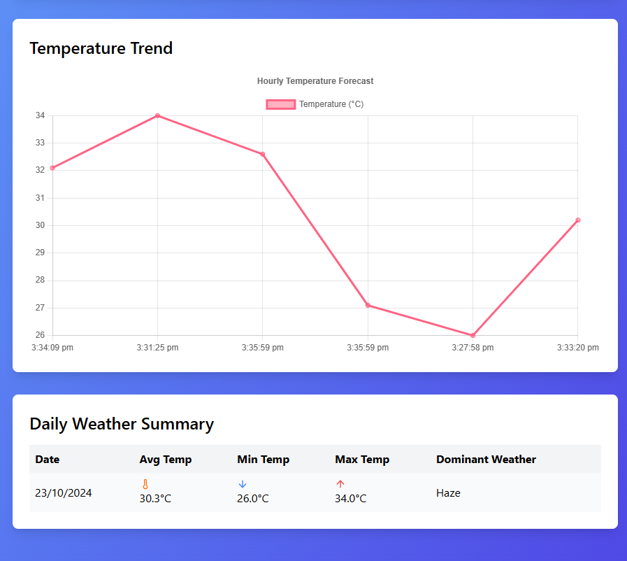

# Weather Monitoring System

A real-time weather monitoring dashboard that tracks and analyzes weather data across major Indian metropolitan cities. Built with React, Chart.js, and the OpenWeatherMap API.




## Features

- **Real-Time Weather Data**: Automatic updates every 5 minutes
- **City Search**: Filter weather data for specific cities
- **Temperature Monitoring**: Track current temperatures and "feels like" metrics
- **Weather Alerts**: Automatic alerts for extreme temperatures
- **Data Visualization**: Interactive charts showing temperature trends
- **Daily Aggregates**: Comprehensive daily weather summaries including:
  - Average temperature
  - Maximum temperature
  - Minimum temperature
  - Dominant weather conditions

## Prerequisites

- Node.js (v14 or higher)
- NPM (v6 or higher)
- OpenWeatherMap API key

## Installation

1. Clone the repository:
```bash
git clone https://github.com/yourusername/weather-monitoring-system.git
cd weather-monitoring-system
```

2. Install dependencies:
```bash
npm install
```

3. Create a `.env` file in the root directory and add your OpenWeatherMap API key:
```env
VITE_WEATHER_API_KEY=your_api_key_here
```

4. Start the development server:
```bash
npm run dev
```

## Project Structure

```
src/
├── api/
│   └── weatherApi.js          # API integration logic
├── components/
│   ├── CurrentWeather.jsx     # Current weather display
│   ├── WeatherAggregates.jsx  # Daily weather summaries
│   ├── WeatherAlerts.jsx      # Temperature alerts
│   ├── WeatherChart.jsx       # Temperature trend chart
│   └── SearchBar.jsx          # City search functionality
├── config/
│   └── constants.js           # Configuration constants
├── utils/
│   └── weatherUtils.js        # Data processing utilities
└── App.jsx                    # Main application component
```

## Configuration

Key configuration options in `src/config/constants.js`:

```javascript
export const WEATHER_CONFIG = {
  UPDATE_INTERVAL: 5 * 60 * 1000,  // Data refresh interval (5 minutes)
  TEMPERATURE_THRESHOLD: 35,        // Alert threshold (Celsius)
  CONSECUTIVE_ALERTS: 2            // Required consecutive high readings
};
```

## Features in Detail

### Real-Time Weather Monitoring
- Automatic data updates every 5 minutes
- Temperature display in Celsius
- "Feels like" temperature metrics
- Current weather conditions with icons

### City Search
- Real-time filtering of weather data
- Case-insensitive search
- Affects all dashboard components simultaneously

### Weather Alerts
- Configurable temperature thresholds
- Visual alerts for extreme conditions
- City-specific alert tracking

### Data Visualization
- Interactive temperature trend charts
- Daily weather summaries
- Historical data tracking

### Daily Aggregates
- Average temperature calculations
- Maximum and minimum temperature tracking
- Dominant weather condition analysis

## Built With

- [React](https://reactjs.org/) - UI Framework
- [Vite](https://vitejs.dev/) - Build Tool
- [Chart.js](https://www.chartjs.org/) - Data Visualization
- [Tailwind CSS](https://tailwindcss.com/) - Styling
- [Lucide React](https://lucide.dev/) - Icons
- [Axios](https://axios-http.com/) - HTTP Client

## API Integration

The system uses the OpenWeatherMap API to fetch weather data. The following endpoints are utilized:

- Current Weather Data: `/data/2.5/weather`

## Contributing

1. Fork the repository
2. Create your feature branch (`git checkout -b feature/AmazingFeature`)
3. Commit your changes (`git commit -m 'Add some AmazingFeature'`)
4. Push to the branch (`git push origin feature/AmazingFeature`)
5. Open a Pull Request

## License

This project is licensed under the MIT License - see the [LICENSE](LICENSE) file for details.

## Acknowledgments

- Weather data provided by [OpenWeatherMap](https://openweathermap.org/)
- Icons by [Lucide](https://lucide.dev/)
- Background image from [Unsplash](https://unsplash.com/)